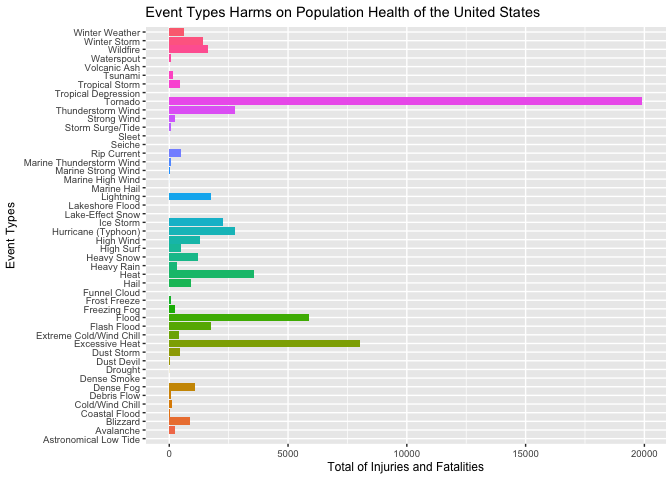
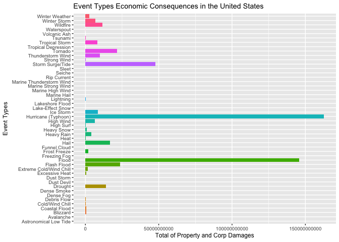
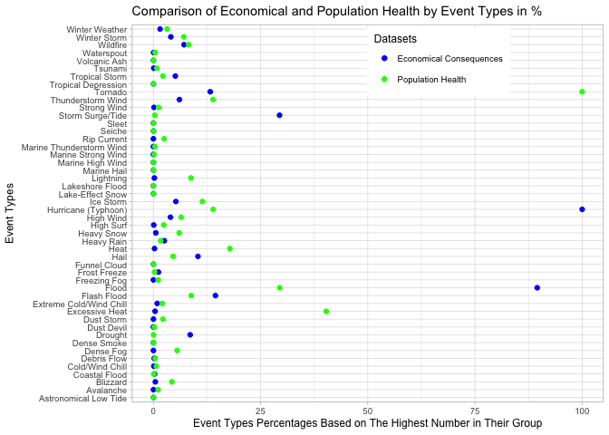

# Reproducible Research: Peer Assessment 2

## Synopsis
This report is providing answers to the two questions listed below:  
1. Across the United States, which Types of events (as indicated in the EVTYPE variable) are most harmful with respect to population health?  
2. Across the United States, which types of events have the greatest economic consequences?  

## Data Processing - Loading and Processing the Raw Data
The analysis was done using the [U.S. National Oceanic and Atmospheric Administration's (NOAA)][1] storm databse. This database starts from 1950 and it ends in November of 2011, tracking the characteristics of major storms and weather events in the United States. Below are also some documentations on definitions and answers to some frequently asked questions:  

• [National Weather Service Storm Data Documentation][2]  
• [National Climatic Data Center Storm Events FAQ][3]  

[1]: https://d396qusza40orc.cloudfront.net/repdata%2Fdata%2FStormData.csv.bz2
[2]: https://d396qusza40orc.cloudfront.net/repdata%2Fpeer2_doc%2Fpd01016005curr.pdf
[3]: https://d396qusza40orc.cloudfront.net/repdata%2Fpeer2_doc%2FNCDC%20Storm%20Events-FAQ%20Page.pdf

#### Reading the data

Downloading and reading/storing the file in .csv format.

```r
download.file("https://d396qusza40orc.cloudfront.net/repdata%2Fdata%2FStormData.csv.bz2", destfile = "../data/stormdata.csv", method = "curl")
stormData <- read.csv("../data/stormdata.csv", header = TRUE)
```
Saving the date/time of downloading and creating stormData file. Then applying some function to gather more information about the dataset, such as the total of variable names (902297 total rows with 37 columns), name of the variables, etc...

```r
stormDataAcessTime <- Sys.time()
dim(stormData)
```

```
## [1] 902297     37
```

```r
names(stormData)
```

```
##  [1] "STATE__"    "BGN_DATE"   "BGN_TIME"   "TIME_ZONE"  "COUNTY"    
##  [6] "COUNTYNAME" "STATE"      "EVTYPE"     "BGN_RANGE"  "BGN_AZI"   
## [11] "BGN_LOCATI" "END_DATE"   "END_TIME"   "COUNTY_END" "COUNTYENDN"
## [16] "END_RANGE"  "END_AZI"    "END_LOCATI" "LENGTH"     "WIDTH"     
## [21] "F"          "MAG"        "FATALITIES" "INJURIES"   "PROPDMG"   
## [26] "PROPDMGEXP" "CROPDMG"    "CROPDMGEXP" "WFO"        "STATEOFFIC"
## [31] "ZONENAMES"  "LATITUDE"   "LONGITUDE"  "LATITUDE_E" "LONGITUDE_"
## [36] "REMARKS"    "REFNUM"
```

## Results
#### Finding the most harmful types of events on population health of the United States:
Here we're providing the results for the first question, to find out the types of events that are most harmful with respect to population health. Our first step is to subset the dataset using only four columns of BGN_DATE, EVTYPE, FATALITIES, and INJURIES (we're using dplyr package to only select the above mentioned columns).


```r
popHealth <- select(stormData, BGN_DATE, EVTYPE, FATALITIES, INJURIES)
```
Here, we're converting the BGN_TYPE column from factor to date type and only showing the year, month, and day. Using the lubridate package, to filter out all the years for the purpose of grouping the new dataset by years and then finding out from what year all the 48 event types are being included.


```r
popHealth$BGN_DATE <- as.Date(strptime(popHealth$BGN_DATE, "%m/%d/%Y"), "%m/%d/%Y")
## Converting BGN_DATE to only show the year (excluding month and day).
popHealth$BGN_DATE <- year(popHealth$BGN_DATE)
## Creating a new database temp and taking out 4 columns from the popHealth databset and filtering by frequency of greater than 0 for either FATALITIES or INJURIES. Then grouping by BGN_DATE(year), following by EVTYPE.
temp <- unique(as.data.frame(select(popHealth, BGN_DATE, EVTYPE, FATALITIES, INJURIES) %>% filter(FATALITIES > 0 | INJURIES > 0) %>% group_by(BGN_DATE, EVTYPE)))
sapply(split(temp, temp$BGN_DATE), nrow)
```

```
## 1950 1951 1952 1953 1954 1955 1956 1957 1958 1959 1960 1961 1962 1963 1964 
##   36   25   45   59   35   25   34   58   29   26   28   33   22   29   36 
## 1965 1966 1967 1968 1969 1970 1971 1972 1973 1974 1975 1976 1977 1978 1979 
##   72   24   41   41   35   32   43   29   62  106   40   42   31   33   33 
## 1980 1981 1982 1983 1984 1985 1986 1987 1988 1989 1990 1991 1992 1993 1994 
##   37   30   41   42   86   56   47   55   58   54   66   53   64  158  203 
## 1995 1996 1997 1998 1999 2000 2001 2002 2003 2004 2005 2006 2007 2008 2009 
##  312  253  289  327  279  225  235  242  231  179  184  203  167  206  155 
## 2010 2011 
##  164  233
```
##### Cleaning data / Creating tidy data
In the situations, of having multiple event types for one observation/row in the EVTYPE column(cell), and factoring-in the negligence of providing further information on how to handle such cases, it was decided to add new row/s based, on the number of event types that were included in one column cell.


```r
dim(temp)
```

```
## [1] 6118    4
```

```r
multiValues <- strsplit(as.character(toupper(temp$EVTYPE)), 'COLD/WIND(*SKIP)(*F)|FROST/FREEZE(*SKIP)(*F)|URBAN/SML(*SKIP)(*F)|SURGE/TIDE(*SKIP)(*F)|URBAN AND SMALL(*SKIP)(*F)|HYPOTHERMIA/EXPOSURE(*SKIP)(*F)|HYPERTHERMIA/EXPOSURE(*SKIP)(*F)|WEATHER/MIX(*SKIP)(*F)|FLOODING/EROSION(*SKIP)(*F)|/|WARM AND DRY(*SKIP)(*F)|LANDSLIDE(*SKIP)(*F)|LANDSLIDES(*SKIP)(*F)| AND | & |- |, ', perl=TRUE)
temp <- data.frame(BGN_DATE=rep(temp$BGN_DATE, sapply(multiValues, FUN=length)), EVTYPE=unlist(multiValues),FATALITIES=rep(temp$FATALITIES, sapply(multiValues, FUN=length)), INJURIES=rep(temp$INJURIES, sapply(multiValues, FUN=length)))
dim(temp)
```

```
## [1] 6289    4
```
There are lots of different event type names (EVTYPE) in the dataset and definitely way more than 48 original event type names. Below, we are going to find the exact type names or near exact type names for each of the 48 event type names. This section is going to be long, yet it would help us to have a better/tidier data to work with.


```r
## 1.  Astronomical Low Tide
#  There are no fatality/injury records for Astronomical Low Tide.
temp$EVTYPE <- ifelse(grepl("*astronomic*", temp$EVTYPE, ignore.case = TRUE), "Astronomical Low Tide", gsub("astronomical", "Astronomical Low Tide", temp$EVTYPE))
## 2.  Avalanche
temp$EVTYPE <- ifelse(grepl("*aval*", temp$EVTYPE, ignore.case = TRUE), "Avalanche", gsub("avalanche", "Avalanche", temp$EVTYPE))
## 3.  Blizzard
temp$EVTYPE <- ifelse(grepl("*bliz*", temp$EVTYPE, ignore.case = TRUE), "Blizzard", gsub("blizzard", "Blizzard", temp$EVTYPE))
## 4.  Coastal Flood
#  Costal storm/Erosion, type names are revised/renamed to Coastal Flood.
temp$EVTYPE <- ifelse(grepl("*coast*|*tidal*", temp$EVTYPE, ignore.case = TRUE), "Coastal Flood", gsub("coastal", "Coastal Flood", temp$EVTYPE))
## 5.  Cold/Wind Chill
#  Low Temperature, type name is revised/renamed to Cold/Wind Chill.
temp$EVTYPE <- ifelse(grepl("^cold*|*temperature", temp$EVTYPE, ignore.case = TRUE), "Cold/Wind Chill", gsub("Cold/Wind Chill", "Cold/Wind Chil", temp$EVTYPE))
## 6.  Debris Flow
#  Slide/Slides, type name is revised/renamed to Debris Flow.
temp$EVTYPE <- ifelse(grepl("*debris*|^slide*|*lands*", temp$EVTYPE, ignore.case = TRUE), "Debris Flow", gsub("Debris", "Debris Flow", temp$EVTYPE))
## 7.  Dense Fog
#  Fog, type name is revised/renamed to Dense Fog.
temp$EVTYPE <- ifelse(grepl("^fog$|^dense*", temp$EVTYPE, ignore.case = TRUE), "Dense Fog", gsub("dense fog", "Dense Fog", temp$EVTYPE))
## 8.  Dense Smoke
# There are no fatality/injury records for Dense Smoke.
temp$EVTYPE <- ifelse(grepl("*smoke*", temp$EVTYPE, ignore.case = TRUE), "Dense Smoke", gsub("dense smoke", "Dense Smoke", temp$EVTYPE))
## 9.  Drought
temp$EVTYPE <- ifelse(grepl("^drought*", temp$EVTYPE, ignore.case = TRUE), "Drought", gsub("drought", "Drought", temp$EVTYPE))
## 10. Dust Devil
temp$EVTYPE <- ifelse(grepl("*devil*", temp$EVTYPE, ignore.case = TRUE), "Dust Devil", gsub("devil", "Dust Devil", temp$EVTYPE))
## 11. Dust Storm
temp$EVTYPE <- ifelse(grepl("*dust storm*", temp$EVTYPE, ignore.case = TRUE), "Dust Storm", gsub("dust storm", "Dust Storm", temp$EVTYPE))
## 12. Excessive Heat
#  Extreme heat type name is revised/renamed to Excessive Heat.
temp$EVTYPE <- ifelse(grepl("*excessive.[^r].*|*extreme.[^wc].*", temp$EVTYPE, ignore.case = TRUE), "Excessive Heat", gsub("excessiveheat", "Excessive Heat", temp$EVTYPE))
## 13. Extreme Cold/Wind Chill
temp$EVTYPE <- ifelse(grepl("^([^c]).*cold*|*extreme wind*", temp$EVTYPE, ignore.case = TRUE), "Extreme Cold/Wind Chill", gsub("extremecoldwindchill", "Extreme Cold/Wind Chill", temp$EVTYPE))
## 14. Flash Flood
#  River flood/Mudslide/Mudslides, type names are revised/renamed to Flash Flood.
temp$EVTYPE <- ifelse(grepl("*flash*|*river*|*mud*", temp$EVTYPE, ignore.case = TRUE), "Flash Flood", gsub("flashflood", "Flash Flood", temp$EVTYPE))
## 15. Flood
temp$EVTYPE <- ifelse(grepl("^flood*|^minor*|*stream*", temp$EVTYPE, ignore.case = TRUE), "Flood", gsub("flXXd", "Flood", temp$EVTYPE))
## 16. Frost/Freeze
temp$EVTYPE <- ifelse(grepl("*freez*|*frost*", temp$EVTYPE, ignore.case = TRUE), "Frost Freeze", gsub("XYZ", "XYZ", temp$EVTYPE))
## 17. Funnel Cloud
temp$EVTYPE <- ifelse(grepl("*funnel*", temp$EVTYPE, ignore.case = TRUE), "Funnel Cloud", gsub("XYZ", "XYZ", temp$EVTYPE))
## 18. Freezing Fog
#  Glaze, type name is revised/renamed to Freezing Fog.
temp$EVTYPE <- ifelse(grepl("*freezing fog*|*glaze*", temp$EVTYPE, ignore.case = TRUE), "Freezing Fog", gsub("XYZ", "XYZ", temp$EVTYPE))
## 19. Hail
temp$EVTYPE <- ifelse(grepl("*small*|*hail*", temp$EVTYPE, ignore.case = TRUE), "Hail", gsub("XYZ", "XYZ", temp$EVTYPE))
## 20. Heat
#  Heat wave drought/Unseasonably warm/Warm weather, type names are revised/renamed to Heat.
temp$EVTYPE <- ifelse(grepl("^heat$|^heat.*wave|*record*|*warm*", temp$EVTYPE, ignore.case = TRUE), "Heat", gsub("XYZ", "XYZ", temp$EVTYPE))
## 21. Heavy Rain
temp$EVTYPE <- ifelse(grepl("*rain*", temp$EVTYPE, ignore.case = TRUE), "Heavy Rain", gsub("XYZ", "XYZ", temp$EVTYPE))
## 22. Heavy Snow
temp$EVTYPE <- ifelse(grepl("*snow*", temp$EVTYPE, ignore.case = TRUE), "Heavy Snow", gsub("XYZ", "XYZ", temp$EVTYPE))
## 23. High Surf
#  High seas/Seas/High waves/Heavy seas/High swells/Rough seas/Drowning/High water/Rapidly rising water, type names are revised/renamed to High Surf.
temp$EVTYPE <- ifelse(grepl("*surf$|*seas$|*wave*|*swells*|*drowning*|*water$", temp$EVTYPE, ignore.case = TRUE), "High Surf", gsub("XYZ", "XYZ", temp$EVTYPE))
## 24. High Wind
temp$EVTYPE <- ifelse(grepl("^high wind*|^wind$|^winds$|^non-severe*", temp$EVTYPE, ignore.case = TRUE), "High Wind", gsub("XYZ", "XYZ", temp$EVTYPE))
## 25. Hurricane (Typhoon)
temp$EVTYPE <- ifelse(grepl("*hurricane*|*typhoon*", temp$EVTYPE, ignore.case = TRUE), "Hurricane (Typhoon)", gsub("XYZ", "XYZ", temp$EVTYPE))
## 26. Ice Storm
#  Ice on road/Icy roads/Black ice/Hypothermia, type names are revised/renamed to Ice Storm.
temp$EVTYPE <- ifelse(grepl("*ice storm*|*ice$|*icy roads$|*ice on *|^ice roads$|*hyp*", temp$EVTYPE, ignore.case = TRUE), "Ice Storm", gsub("XYZ", "XYZ", temp$EVTYPE))
## 27. Lake-Effect Snow
#  There are no fatality/injury records for Lake-Effect Snow.
temp$EVTYPE <- ifelse(grepl("*effect*", temp$EVTYPE, ignore.case = TRUE), "Lake-Effect Snow", gsub("XYZ", "XYZ", temp$EVTYPE))
## 28. Lakeshore Flood
#  There are no fatality/injury records for Lakeshore Flood.
temp$EVTYPE <- ifelse(grepl("*lake*", temp$EVTYPE, ignore.case = TRUE), "Lakeshore Flood", gsub("XYZ", "XYZ", temp$EVTYPE))
## 29. Lightning
temp$EVTYPE <- ifelse(grepl("*light*", temp$EVTYPE, ignore.case = TRUE), "Lightning", gsub("XYZ", "XYZ", temp$EVTYPE))
## 30. Marine Hail
#  There are no fatality/injury records for Marine Hail.
temp$EVTYPE <- ifelse(grepl("*marine hail*", temp$EVTYPE, ignore.case = TRUE), "Marine Hail", gsub("XYZ", "XYZ", temp$EVTYPE))
## 31. Marine High Wind
temp$EVTYPE <- ifelse(grepl("*marine high*", temp$EVTYPE, ignore.case = TRUE), "Marine High Wind", gsub("XYZ", "XYZ", temp$EVTYPE))
## 32. Marine Strong Wind
temp$EVTYPE <- ifelse(grepl("*marine strong*", temp$EVTYPE, ignore.case = TRUE), "Marine Strong Wind", gsub("XYZ", "XYZ", temp$EVTYPE))
## 33. Marine Thunderstorm Wind
#  Marine mishap/Marine accident, type names are revised/renamed to Marine Thunderstorm Wind.
temp$EVTYPE <- ifelse(grepl("*marine thunderstorm*|*marine ts|*mishap*|*accident*", temp$EVTYPE, ignore.case = TRUE), "Marine Thunderstorm Wind", gsub("XYZ", "XYZ", temp$EVTYPE))
## 34. Rip Current
temp$EVTYPE <- ifelse(grepl("*current", temp$EVTYPE, ignore.case = TRUE), "Rip Current", gsub("XYZ", "XYZ", temp$EVTYPE))
## 35. Seiche
#  There are no fatality/injury records for Seiche.
temp$EVTYPE <- ifelse(grepl("*seiche*", temp$EVTYPE, ignore.case = TRUE), "Seiche", gsub("XYZ", "XYZ", temp$EVTYPE))
## 36. Sleet
temp$EVTYPE <- ifelse(grepl("*sleet*", temp$EVTYPE, ignore.case = TRUE), "Sleet", gsub("XYZ", "XYZ", temp$EVTYPE))
## 37. Storm Surge/Tide
temp$EVTYPE <- ifelse(grepl("*surge*", temp$EVTYPE, ignore.case = TRUE), "Storm Surge/Tide", gsub("XYZ", "XYZ", temp$EVTYPE))
## 38. Strong Wind
#  Gusty wind, type name is revised/renamed to Strong Wind.
temp$EVTYPE <- ifelse(grepl("^strong*|*gusty*", temp$EVTYPE, ignore.case = TRUE), "Strong Wind", gsub("XYZ", "XYZ", temp$EVTYPE))
## 39. Tunderstorm Wind
#  Dry microburst/Whirlwind, type names are revised/renamed to Thunderstorm Wind.
temp$EVTYPE <- ifelse(grepl("^thunderstorm*|^TSTM*|^thunder*|*micro*|*mirc*|*wind storm*|*whirl*|^non tstm*", temp$EVTYPE, ignore.case = TRUE), "Thunderstorm Wind", gsub("XYZ", "XYZ", temp$EVTYPE))
## 40. Tornado
#  Mixed precid, type name is revised/renamed to Tornado
temp$EVTYPE <- ifelse(grepl("^tornado*|*precip*", temp$EVTYPE, ignore.case = TRUE), "Tornado", gsub("XYZ", "XYZ", temp$EVTYPE))
## 41. Tropical Depression
#  There are no fatality/injury records for Tropical Depression.
temp$EVTYPE <- ifelse(grepl("*depression*", temp$EVTYPE, ignore.case = TRUE), "Tropical Depression", gsub("XYZ", "XYZ", temp$EVTYPE))
## 42. Tropical Storm
temp$EVTYPE <- ifelse(grepl("*tropical*", temp$EVTYPE, ignore.case = TRUE), "Tropical Storm", gsub("XYZ", "XYZ", temp$EVTYPE))
## 43. Tsunami
temp$EVTYPE <- ifelse(grepl("*tsunami*", temp$EVTYPE, ignore.case = TRUE), "Tsunami", gsub("XYZ", "XYZ", temp$EVTYPE))
## 44. Volcanic Ash
#  There are no fatality/injury records for Volcanic Ash.
temp$EVTYPE <- ifelse(grepl("*volcanic*", temp$EVTYPE, ignore.case = TRUE), "Volcanic Ash", gsub("XYZ", "XYZ", temp$EVTYPE))
## 45. Waterspout
temp$EVTYPE <- ifelse(grepl("*waterspout*", temp$EVTYPE, ignore.case = TRUE), "Waterspout", gsub("XYZ", "XYZ", temp$EVTYPE))
## 46. Wildfire
temp$EVTYPE <- ifelse(grepl("*wild*|*fire*", temp$EVTYPE, ignore.case = TRUE), "Wildfire", gsub("XYZ", "XYZ", temp$EVTYPE))
## 47. Winter Storm
temp$EVTYPE <- ifelse(grepl("*winter storm*", temp$EVTYPE, ignore.case = TRUE), "Winter Storm", gsub("XYZ", "XYZ", temp$EVTYPE))
## 48. Winter Weather
#  Wintry mix, type name is revised/renamed to Winter Weather.
temp$EVTYPE <- ifelse(grepl("*winter weather*|*wintry*", temp$EVTYPE, ignore.case = TRUE), "Winter Weather", gsub("XYZ", "XYZ", temp$EVTYPE))
```
There are eight event type names, that have zero values, in both Fatalities and Injuries, thereby, they are not included in the final analysis (Astronomical Low Tide, Dense Smoke, Lake-Effect Snow, Lakeshore Flood, Marine Hail, Seiche, Tropical Depression, Volcanic Ash).
Additionally, 2 of the rows (OTHER and HIGH), have been removed from the final temp dataset, since they are vague and won't correctly represent or can be related to any event types (the only represent a total of 5 counts).


```r
temp <- temp[-c(1967,4206),]
unique(temp$EVTYPE)
```

```
##  [1] "Tornado"                  "Thunderstorm Wind"       
##  [3] "Hail"                     "Ice Storm"               
##  [5] "Flash Flood"              "Winter Storm"            
##  [7] "Hurricane (Typhoon)"      "High Wind"               
##  [9] "Dense Fog"                "Rip Current"             
## [11] "Lightning"                "Heat"                    
## [13] "Heavy Rain"               "Cold/Wind Chill"         
## [15] "Flood"                    "Extreme Cold/Wind Chill" 
## [17] "Marine Thunderstorm Wind" "High Surf"               
## [19] "Dust Storm"               "Sleet"                   
## [21] "Excessive Heat"           "Strong Wind"             
## [23] "Wildfire"                 "Heavy Snow"              
## [25] "Funnel Cloud"             "Blizzard"                
## [27] "Waterspout"               "Storm Surge/Tide"        
## [29] "Tropical Storm"           "Avalanche"               
## [31] "Frost Freeze"             "Winter Weather"          
## [33] "Freezing Fog"             "Dust Devil"              
## [35] "Debris Flow"              "Drought"                 
## [37] "Coastal Flood"            "Marine Strong Wind"      
## [39] "Marine High Wind"         "Tsunami"
```
After, manipulating our temp dataset, below are our findings:
• Tornado, is the only tracked event type from 1950 to 1982.
• Tornado, Thunderstorm, and Hail, are the only tracked type events from 1983 to 1992.
• As you may see from the below occurance numbers, too, it is mostly starting from 1993, that most event types are being added/tracked.
As a conclusion, we're going to modify our temp data, to a smaller dataset, which would only have data starting from 1993 to 2011.


```r
countEVTYPE = as.data.frame(count(unique(select(temp, BGN_DATE, unique(EVTYPE)) %>% group_by(BGN_DATE))))
# Here, we are displaying the numbers of occurrence for each event type.
countEVTYPE
```

```
##    BGN_DATE  n
## 1      1950  1
## 2      1951  1
## 3      1952  1
## 4      1953  1
## 5      1954  1
## 6      1955  1
## 7      1956  1
## 8      1957  1
## 9      1958  1
## 10     1959  1
## 11     1960  1
## 12     1961  1
## 13     1962  1
## 14     1963  1
## 15     1964  1
## 16     1965  1
## 17     1966  1
## 18     1967  1
## 19     1968  1
## 20     1969  1
## 21     1970  1
## 22     1971  1
## 23     1972  1
## 24     1973  1
## 25     1974  1
## 26     1975  1
## 27     1976  1
## 28     1977  1
## 29     1978  1
## 30     1979  1
## 31     1980  1
## 32     1981  1
## 33     1982  1
## 34     1983  2
## 35     1984  3
## 36     1985  3
## 37     1986  3
## 38     1987  3
## 39     1988  3
## 40     1989  3
## 41     1990  3
## 42     1991  3
## 43     1992  3
## 44     1993 25
## 45     1994 25
## 46     1995 31
## 47     1996 29
## 48     1997 30
## 49     1998 30
## 50     1999 26
## 51     2000 25
## 52     2001 28
## 53     2002 27
## 54     2003 28
## 55     2004 27
## 56     2005 28
## 57     2006 30
## 58     2007 27
## 59     2008 29
## 60     2009 30
## 61     2010 23
## 62     2011 28
```

```r
# Below, we are creating our smaller new dataset (1993 to 2011).
dim(temp)
```

```
## [1] 6287    4
```

```r
temp <- as.data.frame(select(temp, BGN_DATE, EVTYPE, FATALITIES, INJURIES) %>% filter(BGN_DATE >= 1993))
countEVTYPE = as.data.frame(count(unique(select(temp, BGN_DATE, unique(EVTYPE)) %>% group_by(BGN_DATE))))
dim(temp)
```

```
## [1] 4414    4
```
To see that which event types are the most harmful to the U.S. population health, we are going to sum up the values of fatalities and injuries across years, for each event type. The result is being shown with histogram, and it is clear that tornado, Excessive Heat, and Flood, pose the most harm across the United States.


```r
tempTypeSum <- as.data.frame(select(temp, FATALITIES, INJURIES, EVTYPE) %>% group_by(EVTYPE) %>% summarize(HARMS = sum(FATALITIES, INJURIES)))
# Adding the 8 rows for event types with 0 values.
tempTypeSum <- rbind(tempTypeSum, data.frame(EVTYPE = as.character(c("Astronomical Low Tide", "Dense Smoke", "Lake-Effect Snow", "Lakeshore Flood", "Marine Hail", "Seiche", "Tropical Depression", "Volcanic Ash")), HARMS = as.numeric(rep(c(0),8))))
```
As we may see from the numbers and the plot, Tornado, Excessive Heat, and Flood, have the most harmful types of events to the entire U.S. population health (measuring the fatalities and injuries cause by such events).


```r
# Printing out the total numbers for each event type.
arrange(tempTypeSum, desc(HARMS))
```

```
##                      EVTYPE HARMS
## 1                   Tornado 19915
## 2            Excessive Heat  8028
## 3                     Flood  5869
## 4                      Heat  3553
## 5       Hurricane (Typhoon)  2776
## 6         Thunderstorm Wind  2773
## 7                 Ice Storm  2274
## 8               Flash Flood  1759
## 9                 Lightning  1740
## 10                 Wildfire  1643
## 11             Winter Storm  1412
## 12                High Wind  1288
## 13               Heavy Snow  1201
## 14                Dense Fog  1104
## 15                     Hail   916
## 16                 Blizzard   859
## 17           Winter Weather   636
## 18              Rip Current   498
## 19                High Surf   479
## 20               Dust Storm   444
## 21           Tropical Storm   440
## 22  Extreme Cold/Wind Chill   409
## 23               Heavy Rain   337
## 24              Strong Wind   241
## 25             Freezing Fog   224
## 26                Avalanche   223
## 27                  Tsunami   162
## 28          Cold/Wind Chill   135
## 29              Debris Flow    88
## 30               Waterspout    78
## 31 Marine Thunderstorm Wind    66
## 32         Storm Surge/Tide    65
## 33             Frost Freeze    53
## 34               Dust Devil    45
## 35       Marine Strong Wind    33
## 36            Coastal Flood    20
## 37                  Drought     6
## 38             Funnel Cloud     3
## 39         Marine High Wind     2
## 40                    Sleet     2
## 41    Astronomical Low Tide     0
## 42              Dense Smoke     0
## 43         Lake-Effect Snow     0
## 44          Lakeshore Flood     0
## 45              Marine Hail     0
## 46                   Seiche     0
## 47      Tropical Depression     0
## 48             Volcanic Ash     0
```

```r
# Creating the plot to display the graphical model of our dataset.
theme_set(theme_gray(base_size = 9))
g <- ggplot(data = tempTypeSum, aes(x = EVTYPE, y = HARMS, fill = EVTYPE)) + geom_bar(stat = "identity") + coord_flip() + guides(fill=FALSE) + ggtitle("Event Types Harms on Population Health of the United States") + labs(x = "Event Types", y = "Total of Injuries and Fatalities")
g
```

<!-- -->
  
#### Finding which types of events have the greatest economic consequences on the United States:

```r
# Creating a new dataset with 6 variables of (BGN_DATE, EVTYPE, PROPDMG, PRODMGEXP, CROPDMG, CROPDMGEXP).
economicDamage <- select(stormData, BGN_DATE, EVTYPE, PROPDMG, PROPDMGEXP, CROPDMG, CROPDMGEXP)
```
Below, we are converting the BGN_DATE variable to only show the 4 digits of year. Then, we are creating a new dataset for only values higher than 0 for both PROPDMG and CROPDMG variables.


```r
economicDamage$BGN_DATE <- as.Date(strptime(economicDamage$BGN_DATE, "%m/%d/%Y"), "%m/%d/%Y")
economicDamage$BGN_DATE <- year(economicDamage$BGN_DATE)
temp2 <- unique(as.data.frame(select(economicDamage, BGN_DATE, EVTYPE, PROPDMG, PROPDMGEXP, CROPDMG, CROPDMGEXP) %>% filter(PROPDMG > 0 | CROPDMG > 0) %>% group_by(BGN_DATE, EVTYPE)))
sapply(split(temp2, temp2$BGN_DATE), nrow)
```

```
## 1950 1951 1952 1953 1954 1955 1956 1957 1958 1959 1960 1961 1962 1963 1964 
##    6    7    7    8    7    7    6    7    7    7    7    7    6    7    7 
## 1965 1966 1967 1968 1969 1970 1971 1972 1973 1974 1975 1976 1977 1978 1979 
##    8    8    7    7    7    8    7    7    8    8    8    7    7    8    8 
## 1980 1981 1982 1983 1984 1985 1986 1987 1988 1989 1990 1991 1992 1993 1994 
##    8    8    8    7    7    8    8    7    8    8    8    8    8  382  709 
## 1995 1996 1997 1998 1999 2000 2001 2002 2003 2004 2005 2006 2007 2008 2009 
## 1754 1692 1708 2195 1436 1651 1456 1368 1520 1464 1520 1726 1475 1883 1516 
## 2010 2011 
## 1510 1840
```
##### Cleaning data / Creating tidy data
Here, we are aiming to consolidate the EVTYPE to our 48 original event types names.


```r
multiValues2 <- strsplit(as.character(toupper(temp2$EVTYPE)), 'COLD/WIND(*SKIP)(*F)|FROST/FREEZE(*SKIP)(*F)|URBAN/SML(*SKIP)(*F)|SURGE/TIDE(*SKIP)(*F)|URBAN AND SMALL(*SKIP)(*F)|URBAN/SMALL(*SKIP)(*F)|COOL AND WET(*SKIP)(*F)|HYPOTHERMIA/EXPOSURE(*SKIP)(*F)|HYPERTHERMIA/EXPOSURE(*SKIP)(*F)|WEATHER/MIX(*SKIP)(*F)|FLOODING/EROSION(*SKIP)(*F)|FLOOD/ STREET(*SKIP)(*F)|/|WARM AND DRY(*SKIP)(*F)|LANDSLIDE(*SKIP)(*F)|WIND/AWNING(*SKIP)(*F)|LANDSLIDES(*SKIP)(*F)|WIND/ TREES(*SKIP)(*F)|WIND/ TREE(*SKIP)(*F)| AND | & |- |, ', perl=TRUE)
temp2 <- data.frame(BGN_DATE=rep(temp2$BGN_DATE, sapply(multiValues2, FUN=length)), EVTYPE=unlist(multiValues2),PROPDMG=rep(temp2$PROPDMG, sapply(multiValues2, FUN=length)), PROPDMGEXP=rep(temp2$PROPDMGEXP, sapply(multiValues2, FUN=length)), CROPDMG=rep(temp2$CROPDMG, sapply(multiValues2, FUN=length)), CROPDMGEXP=rep(temp2$CROPDMGEXP, sapply(multiValues2, FUN=length)))
dim(temp2)
```

```
## [1] 29844     6
```
Eventually, after processing the below commands, to shorten our EVTYPE variable to match with the original 48 event types names, we come out to match 44 varaibles (after removing varibales of "OTHER" and "?").


```r
## 1.  Astronomical Low Tide
temp2$EVTYPE <- ifelse(grepl("*astronomic*", temp2$EVTYPE, ignore.case = TRUE), "Astronomical Low Tide", gsub("astronomical", "Astronomical Low Tide", temp2$EVTYPE))
## 2.  Avalanche
temp2$EVTYPE <- ifelse(grepl("*aval*", temp2$EVTYPE, ignore.case = TRUE), "Avalanche", gsub("avalanche", "Avalanche", temp2$EVTYPE))
## 3.  Blizzard
temp2$EVTYPE <- ifelse(grepl("*bliz*", temp2$EVTYPE, ignore.case = TRUE), "Blizzard", gsub("blizzard", "Blizzard", temp2$EVTYPE))
## 4.  Coastal Flood
#  Costal storm/Erosion/CSTL flood, type names are revised/renamed to Coastal Flood.
temp2$EVTYPE <- ifelse(grepl("*coast*|*tidal*|^erosion|*cstl*", temp2$EVTYPE, ignore.case = TRUE), "Coastal Flood", gsub("coastal", "Coastal Flood", temp2$EVTYPE))
## 5.  Cold/Wind Chill
#  Low Temperature, type name is revised/renamed to Cold/Wind Chill.
temp2$EVTYPE <- ifelse(grepl("^cold*|*temperature", temp2$EVTYPE, ignore.case = TRUE), "Cold/Wind Chill", gsub("Cold/Wind Chill", "Cold/Wind Chil", temp2$EVTYPE))
## 6.  Debris Flow
#  Slide/Slides/Rock Slide, type names are revised/renamed to Debris Flow.
temp2$EVTYPE <- ifelse(grepl("*debris*|^slide*|*lands*|*rock*", temp2$EVTYPE, ignore.case = TRUE), "Debris Flow", gsub("Debris", "Debris Flow", temp2$EVTYPE))
## 7.  Dense Fog
#  Fog, type name is revised/renamed to Dense Fog.
temp2$EVTYPE <- ifelse(grepl("^fog$|^dense*", temp2$EVTYPE, ignore.case = TRUE), "Dense Fog", gsub("dense fog", "Dense Fog", temp2$EVTYPE))
## 8.  Dense Smoke
#  There are no property damge/crop damage records for Dense Smoke.
temp2$EVTYPE <- ifelse(grepl("*smoke*", temp2$EVTYPE, ignore.case = TRUE), "Dense Smoke", gsub("dense smoke", "Dense Smoke", temp2$EVTYPE))
## 9.  Drought
temp2$EVTYPE <- ifelse(grepl("^drought*", temp2$EVTYPE, ignore.case = TRUE), "Drought", gsub("drought", "Drought", temp2$EVTYPE))
## 10. Dust Devil
temp2$EVTYPE <- ifelse(grepl("*devil*", temp2$EVTYPE, ignore.case = TRUE), "Dust Devil", gsub("devil", "Dust Devil", temp2$EVTYPE))
## 11. Dust Storm
#  Blowing dust, type name is revised/renamed to Dust Strom.
temp2$EVTYPE <- ifelse(grepl("*dust storm*|*blowing*", temp2$EVTYPE, ignore.case = TRUE), "Dust Storm", gsub("dust storm", "Dust Storm", temp2$EVTYPE))
## 12. Excessive Heat
#  Extreme heat type name is revised/renamed to Excessive Heat.
temp2$EVTYPE <- ifelse(grepl("*excessive.[^r].*|*extreme.[^wc].*", temp2$EVTYPE, ignore.case = TRUE), "Excessive Heat", gsub("excessiveheat", "Excessive Heat", temp2$EVTYPE))
## 13. Extreme Cold/Wind Chill
temp2$EVTYPE <- ifelse(grepl("^([^c]).*cold*|*extreme wind*", temp2$EVTYPE, ignore.case = TRUE), "Extreme Cold/Wind Chill", gsub("extremecoldwindchill", "Extreme Cold/Wind Chill", temp2$EVTYPE))
## 14. Flash Flood
#  River flood/Mudslide/Mudslides/Breakup flooding/Rural flood/Dam break, type names are revised/renamed to Flash Flood.
temp2$EVTYPE <- ifelse(grepl("*flash*|*river*|*mud*|*breakup*|*rural*|*dam break*", temp2$EVTYPE, ignore.case = TRUE), "Flash Flood", gsub("flashflood", "Flash Flood", temp2$EVTYPE))
## 15. Flood
#  Severe Turbulence/Urban Flood/Major flood, type name is revised/renamed to Flood.
temp2$EVTYPE <- ifelse(grepl("^flood*|^minor*|*stream*|*turbulence*|^urban*|major|^ flood*", temp2$EVTYPE, ignore.case = TRUE), "Flood", gsub("flXXd", "Flood", temp2$EVTYPE))
## 16. Frost/Freeze
temp2$EVTYPE <- ifelse(grepl("*freez*|*frost*", temp2$EVTYPE, ignore.case = TRUE), "Frost Freeze", gsub("XYZ", "XYZ", temp2$EVTYPE))
## 17. Funnel Cloud
temp2$EVTYPE <- ifelse(grepl("*funnel*", temp2$EVTYPE, ignore.case = TRUE), "Funnel Cloud", gsub("XYZ", "XYZ", temp2$EVTYPE))
## 18. Freezing Fog
#  Glaze, type name is revised/renamed to Freezing Fog.
temp2$EVTYPE <- ifelse(grepl("*freezing fog*|*glaze*", temp2$EVTYPE, ignore.case = TRUE), "Freezing Fog", gsub("XYZ", "XYZ", temp2$EVTYPE))
## 19. Hail
temp2$EVTYPE <- ifelse(grepl("*small*|*hail*", temp2$EVTYPE, ignore.case = TRUE), "Hail", gsub("XYZ", "XYZ", temp2$EVTYPE))
## 20. Heat
#  Heat wave drought/Unseasonably warm/Warm weather, type names are revised/renamed to Heat.
temp2$EVTYPE <- ifelse(grepl("^heat$|^heat.*wave|*record*|*warm*", temp2$EVTYPE, ignore.case = TRUE), "Heat", gsub("XYZ", "XYZ", temp2$EVTYPE))
## 21. Heavy Rain
#  Cool and wet/Wet conditions, type names are revised/renamed to Heavy Rain.
temp2$EVTYPE <- ifelse(grepl("*rain*|*shower*|^wet condition*|cool and wet*", temp2$EVTYPE, ignore.case = TRUE), "Heavy Rain", gsub("XYZ", "XYZ", temp2$EVTYPE))
## 22. Heavy Snow
temp2$EVTYPE <- ifelse(grepl("*snow*", temp2$EVTYPE, ignore.case = TRUE), "Heavy Snow", gsub("XYZ", "XYZ", temp2$EVTYPE))
## 23. High Surf
#  High seas/Seas/High waves/Heavy seas/High swells/Rough seas/Drowning/High water/Rapidly rising water/High Tide/Beach erosion, type names are revised/renamed to High Surf.
temp2$EVTYPE <- ifelse(grepl("*surf$|*seas$|*wave*|*swells*|*drowning*|*water$|^high tide*|*high surf advis*|^beach", temp2$EVTYPE, ignore.case = TRUE), "High Surf", gsub("XYZ", "XYZ", temp2$EVTYPE))
## 24. High Wind
temp2$EVTYPE <- ifelse(grepl("^high wind*|^wind$|^winds$|^non-severe*|high  wind*", temp2$EVTYPE, ignore.case = TRUE), "High Wind", gsub("XYZ", "XYZ", temp2$EVTYPE))
## 25. Hurricane (Typhoon)
temp2$EVTYPE <- ifelse(grepl("*hurricane*|*typhoon*", temp2$EVTYPE, ignore.case = TRUE), "Hurricane (Typhoon)", gsub("XYZ", "XYZ", temp2$EVTYPE))
## 26. Ice Storm
#  Ice on road/Icy roads/Black ice/Hypothermia/Ice jam flood, type names are revised/renamed to Ice Storm.
temp2$EVTYPE <- ifelse(grepl("*ice storm*|*ice$|*icy roads$|*ice on *|^ice roads$|*hyp*|^ice jam|^ice floe", temp2$EVTYPE, ignore.case = TRUE), "Ice Storm", gsub("XYZ", "XYZ", temp2$EVTYPE))
## 27. Lake-Effect Snow
#  There are no property damge/crop damage records for Lake-Effect Snow.
temp2$EVTYPE <- ifelse(grepl("*effect*", temp2$EVTYPE, ignore.case = TRUE), "Lake-Effect Snow", gsub("XYZ", "XYZ", temp2$EVTYPE))
## 28. Lakeshore Flood
temp2$EVTYPE <- ifelse(grepl("*lake*", temp2$EVTYPE, ignore.case = TRUE), "Lakeshore Flood", gsub("XYZ", "XYZ", temp2$EVTYPE))
## 29. Lightning
temp2$EVTYPE <- ifelse(grepl("*light*|ligntning", temp2$EVTYPE, ignore.case = TRUE), "Lightning", gsub("XYZ", "XYZ", temp2$EVTYPE))
## 30. Marine Hail
#  There are no property damge/crop damage records for Marine Hail.
temp2$EVTYPE <- ifelse(grepl("*marine hail*", temp2$EVTYPE, ignore.case = TRUE), "Marine Hail", gsub("XYZ", "XYZ", temp2$EVTYPE))
## 31. Marine High Wind
temp2$EVTYPE <- ifelse(grepl("*marine high*", temp2$EVTYPE, ignore.case = TRUE), "Marine High Wind", gsub("XYZ", "XYZ", temp2$EVTYPE))
## 32. Marine Strong Wind
temp2$EVTYPE <- ifelse(grepl("*marine strong*", temp2$EVTYPE, ignore.case = TRUE), "Marine Strong Wind", gsub("XYZ", "XYZ", temp2$EVTYPE))
## 33. Marine Thunderstorm Wind
#  Marine mishap/Marine accident, type names are revised/renamed to Marine Thunderstorm Wind.
temp2$EVTYPE <- ifelse(grepl("*marine thunderstorm*|*marine ts|*mishap*|*accident*", temp2$EVTYPE, ignore.case = TRUE), "Marine Thunderstorm Wind", gsub("XYZ", "XYZ", temp2$EVTYPE))
## 34. Rip Current
temp2$EVTYPE <- ifelse(grepl("*current", temp2$EVTYPE, ignore.case = TRUE), "Rip Current", gsub("XYZ", "XYZ", temp2$EVTYPE))
## 35. Seiche
#  Squalls, type name is revised/renamed to Seiche.
temp2$EVTYPE <- ifelse(grepl("*seiche*|*squall*", temp2$EVTYPE, ignore.case = TRUE), "Seiche", gsub("XYZ", "XYZ", temp2$EVTYPE))
## 36. Sleet
temp2$EVTYPE <- ifelse(grepl("*sleet*", temp2$EVTYPE, ignore.case = TRUE), "Sleet", gsub("XYZ", "XYZ", temp2$EVTYPE))
## 37. Storm Surge/Tide
temp2$EVTYPE <- ifelse(grepl("*surge*", temp2$EVTYPE, ignore.case = TRUE), "Storm Surge/Tide", gsub("XYZ", "XYZ", temp2$EVTYPE))
## 38. Strong Wind
#  Gusty wind, type name is revised/renamed to Strong Wind.
temp2$EVTYPE <- ifelse(grepl("^strong*|*gusty*", temp2$EVTYPE, ignore.case = TRUE), "Strong Wind", gsub("XYZ", "XYZ", temp2$EVTYPE))
## 39. Tunderstorm Wind
#  Dry microburst/Whirlwind/Wind damage/Downburst/Apache county, type names are revised/renamed to Thunderstorm Wind.
temp2$EVTYPE <- ifelse(grepl("^thunderstorm*|^TSTM*|^thunder*|*micro*|*mirc*|*wind storm*|*whirl*|^non tstm*|^thude*|^thunerstorm wind*|^tunder*|severe.[^w]|* tstm wind*|^non-tstm wind*|*damage*|*downburst*|*apache*", temp2$EVTYPE, ignore.case = TRUE), "Thunderstorm Wind", gsub("XYZ", "XYZ", temp2$EVTYPE))
## 40. Tornado
#  Mixed precid, type name is revised/renamed to Tornado
temp2$EVTYPE <- ifelse(grepl("^tornado*|*precip*| tornado|^torndao", temp2$EVTYPE, ignore.case = TRUE), "Tornado", gsub("XYZ", "XYZ", temp2$EVTYPE))
## 41. Tropical Depression
#  # There are no property damge/crop damage records for Tropical Depression.
temp2$EVTYPE <- ifelse(grepl("*depression*|*gradient wind*", temp2$EVTYPE, ignore.case = TRUE), "Tropical Depression", gsub("XYZ", "XYZ", temp2$EVTYPE))
## 42. Tropical Storm
#  Storm force winds, type name is revised/renamed to Tropical Storm.
temp2$EVTYPE <- ifelse(grepl("*tropical*|*force*", temp2$EVTYPE, ignore.case = TRUE), "Tropical Storm", gsub("XYZ", "XYZ", temp2$EVTYPE))
## 43. Tsunami
temp2$EVTYPE <- ifelse(grepl("*tsunami*", temp2$EVTYPE, ignore.case = TRUE), "Tsunami", gsub("XYZ", "XYZ", temp2$EVTYPE))
## 44. Volcanic Ash
temp2$EVTYPE <- ifelse(grepl("*volcanic*", temp2$EVTYPE, ignore.case = TRUE), "Volcanic Ash", gsub("XYZ", "XYZ", temp2$EVTYPE))
## 45. Waterspout
temp2$EVTYPE <- ifelse(grepl("*waterspout*", temp2$EVTYPE, ignore.case = TRUE), "Waterspout", gsub("XYZ", "XYZ", temp2$EVTYPE))
## 46. Wildfire
temp2$EVTYPE <- ifelse(grepl("*wild*|*fire*", temp2$EVTYPE, ignore.case = TRUE), "Wildfire", gsub("XYZ", "XYZ", temp2$EVTYPE))
## 47. Winter Storm
#  Heavy mix, type name is revised/renamed to Winter Storm.
temp2$EVTYPE <- ifelse(grepl("*winter storm*|*heavy mix*", temp2$EVTYPE, ignore.case = TRUE), "Winter Storm", gsub("XYZ", "XYZ", temp2$EVTYPE))
## 48. Winter Weather
#  Wintry mix/Severe weather, type names are revised/renamed to Winter Weather.
temp2$EVTYPE <- ifelse(grepl("*winter weather*|*wintry*|^severe weather", temp2$EVTYPE, ignore.case = TRUE), "Winter Weather", gsub("XYZ", "XYZ", temp2$EVTYPE))
```
There are four event type names, that have zero values, in both PROPDMG and CROPDMG, thereby, they are not included in the final analysis (Dense Smoke, Lake-Effect Snow, Marine Hail, and Tropical Depression).

We are going to remove rows for "OTHER" and "?", since they are vague in descriptions and also, they won't effect our final results, to a degree that we may be much concerned of.


```r
temp2 <- temp2[-c(3251, 3594, 6198, 6341, 11829),]
unique(temp2$EVTYPE)
```

```
##  [1] "Tornado"                  "Winter Storm"            
##  [3] "Hurricane (Typhoon)"      "High Wind"               
##  [5] "Thunderstorm Wind"        "Heavy Rain"              
##  [7] "Lightning"                "Dense Fog"               
##  [9] "Hail"                     "Flash Flood"             
## [11] "Flood"                    "Waterspout"              
## [13] "Heat"                     "Frost Freeze"            
## [15] "Avalanche"                "High Surf"               
## [17] "Coastal Flood"            "Heavy Snow"              
## [19] "Dust Devil"               "Dust Storm"              
## [21] "Ice Storm"                "Funnel Cloud"            
## [23] "Strong Wind"              "Wildfire"                
## [25] "Extreme Cold/Wind Chill"  "Blizzard"                
## [27] "Storm Surge/Tide"         "Tropical Storm"          
## [29] "Freezing Fog"             "Drought"                 
## [31] "Cold/Wind Chill"          "Excessive Heat"          
## [33] "Sleet"                    "Lakeshore Flood"         
## [35] "Winter Weather"           "Seiche"                  
## [37] "Debris Flow"              "Marine Thunderstorm Wind"
## [39] "Rip Current"              "Volcanic Ash"            
## [41] "Astronomical Low Tide"    "Marine High Wind"        
## [43] "Tsunami"                  "Marine Strong Wind"
```
After, manipulating our temp2 dataset, below are out findings:
• Tornado, is the only tracked event type from 1950 to 1992
• As you may see from the below occurance numbers, too, it is mostly starting from 1993, that most event types are being added/tracked.
As a conclusion, we're going to modify our temp data, to a smaller dataset, which would only have data starting from 1993 to 2011.


```r
countEVTYPE2 = as.data.frame(count(unique(select(temp2, BGN_DATE, unique(EVTYPE)) %>% group_by(BGN_DATE))))
# Here, we are displaying the numbers of occurrence for each event type.
countEVTYPE2
```

```
##    BGN_DATE  n
## 1      1950  1
## 2      1951  1
## 3      1952  1
## 4      1953  1
## 5      1954  1
## 6      1955  1
## 7      1956  1
## 8      1957  1
## 9      1958  1
## 10     1959  1
## 11     1960  1
## 12     1961  1
## 13     1962  1
## 14     1963  1
## 15     1964  1
## 16     1965  1
## 17     1966  1
## 18     1967  1
## 19     1968  1
## 20     1969  1
## 21     1970  1
## 22     1971  1
## 23     1972  1
## 24     1973  1
## 25     1974  1
## 26     1975  1
## 27     1976  1
## 28     1977  1
## 29     1978  1
## 30     1979  1
## 31     1980  1
## 32     1981  1
## 33     1982  1
## 34     1983  1
## 35     1984  1
## 36     1985  1
## 37     1986  1
## 38     1987  1
## 39     1988  1
## 40     1989  1
## 41     1990  1
## 42     1991  1
## 43     1992  1
## 44     1993 31
## 45     1994 33
## 46     1995 34
## 47     1996 30
## 48     1997 31
## 49     1998 34
## 50     1999 32
## 51     2000 28
## 52     2001 28
## 53     2002 29
## 54     2003 30
## 55     2004 29
## 56     2005 34
## 57     2006 34
## 58     2007 33
## 59     2008 33
## 60     2009 34
## 61     2010 34
## 62     2011 37
```

```r
# Below, we are creating our smaller new dataset (1993 to 2011).
dim(temp2)
```

```
## [1] 29839     6
```

```r
temp2 <- as.data.frame(select(temp2, BGN_DATE, EVTYPE, PROPDMG, PROPDMGEXP, CROPDMG, CROPDMGEXP) %>% filter(BGN_DATE >= 1993))
countEVTYPE = as.data.frame(count(unique(select(temp2, BGN_DATE, unique(EVTYPE)) %>% group_by(BGN_DATE))))
dim(temp2)
```

```
## [1] 29522     6
```
Below, we are substituting the following values in PROPDMGEXP and CROPDMGEXP: H/h, K/k, M/m, B/b, +, -, ?, blank/empty character, 0-8 respectfully with: 100, 1000, 1000000, 1000000000, 1, 0, 0, 0, 10.


```r
# Disabling scientific notations
options("scipen"=10)
# Replacing 0-8, to 10 in PROPDMGEXP
temp2$PROPDMGEXP <- ifelse(grepl("0|1|2|3|4|5|6|7|8", temp2$PROPDMGEXP, ignore.case = TRUE), 10, gsub("XYZ", "XYZ", temp2$PROPDMGEXP))
# Replacing +, with 1 in PROPDMGEXP
temp2$PROPDMGEXP <- ifelse(grepl("+", temp2$PROPDMGEXP, fixed = TRUE), 1, gsub("XYZ", "XYZ", temp2$PROPDMGEXP))
# Replacing -, with 0 in PROPDMGEXP
temp2$PROPDMGEXP <- ifelse(grepl("-", temp2$PROPDMGEXP, fixed = TRUE), 0, gsub("XYZ", "XYZ", temp2$PROPDMGEXP))
# Replacing ?, with 0 in PROPDMGEXP
temp2$PROPDMGEXP <- ifelse(grepl("?", temp2$PROPDMGEXP, fixed = TRUE), 0, gsub("XYZ", "XYZ", temp2$PROPDMGEXP))
# Replacing H/h, with 100 in PROPDMGEXP
temp2$PROPDMGEXP <- ifelse(grepl("h", temp2$PROPDMGEXP, ignore.case = TRUE), 100, gsub("XYZ", "XYZ", temp2$PROPDMGEXP))
# Replacing K/k, with 1000 in PROPDMGEXP
temp2$PROPDMGEXP <- ifelse(grepl("k", temp2$PROPDMGEXP, ignore.case = TRUE), 1000, gsub("XYZ", "XYZ", temp2$PROPDMGEXP))
# Replacing M/m, with 1000000 in PROPDMGEXP
temp2$PROPDMGEXP <- ifelse(grepl("m", temp2$PROPDMGEXP, ignore.case = TRUE), 1000000, gsub("XYZ", "XYZ", temp2$PROPDMGEXP))
# Replacing B/b, with 1000000000 in PROPDMGEXP
temp2$PROPDMGEXP <- ifelse(grepl("b", temp2$PROPDMGEXP, ignore.case = TRUE), 1000000000, gsub("XYZ", "XYZ", temp2$PROPDMGEXP))
# Replacing ""/blank character, with 0 in PROPDMGEXP
temp2$PROPDMGEXP <- ifelse(grepl("^[[:space:]]*$", temp2$PROPDMGEXP, ignore.case = TRUE), 0, gsub("XYZ", "XYZ", temp2$PROPDMGEXP))
####
# Replacing 0-8, to 10 in CROPDMGEXP
temp2$CROPDMGEXP <- ifelse(grepl("0|1|2|3|4|5|6|7|8", temp2$CROPDMGEXP, ignore.case = TRUE), 10, gsub("XYZ", "XYZ", temp2$CROPDMGEXP))
# Replacing +, with 1 in CROPDMGEXP
temp2$CROPDMGEXP <- ifelse(grepl("+", temp2$CROPDMGEXP, fixed = TRUE), 1, gsub("XYZ", "XYZ", temp2$CROPDMGEXP))
# Replacing -, with 0 in CROPDMGEXP
temp2$CROPDMGEXP <- ifelse(grepl("-", temp2$CROPDMGEXP, fixed = TRUE), 0, gsub("XYZ", "XYZ", temp2$CROPDMGEXP))
# Replacing ?, with 0 in CROPDMGEXP
temp2$CROPDMGEXP <- ifelse(grepl("?", temp2$CROPDMGEXP, fixed = TRUE), 0, gsub("XYZ", "XYZ", temp2$CROPDMGEXP))
# Replacing H/h, with 100 in CROPDMGEXP
temp2$CROPDMGEXP <- ifelse(grepl("h", temp2$CROPDMGEXP, ignore.case = TRUE), 100, gsub("XYZ", "XYZ", temp2$CROPDMGEXP))
# Replacing K/k, with 1000 in CROPDMGEXP
temp2$CROPDMGEXP <- ifelse(grepl("k", temp2$CROPDMGEXP, ignore.case = TRUE), 1000, gsub("XYZ", "XYZ", temp2$CROPDMGEXP))
# Replacing M/m, with 1000000 in CROPDMGEXP
temp2$CROPDMGEXP <- ifelse(grepl("m", temp2$CROPDMGEXP, ignore.case = TRUE), 1000000, gsub("XYZ", "XYZ", temp2$CROPDMGEXP))
# Replacing B/b, with 1000000000 in CROPDMGEXP
temp2$CROPDMGEXP <- ifelse(grepl("b", temp2$CROPDMGEXP, ignore.case = TRUE), 1000000000, gsub("XYZ", "XYZ", temp2$CROPDMGEXP))
# Replacing ""/blank character, with 0 in CROPDMGEXP
temp2$CROPDMGEXP <- ifelse(grepl("^[[:space:]]*$", temp2$CROPDMGEXP, ignore.case = TRUE), 0, gsub("XYZ", "XYZ", temp2$CROPDMGEXP))
dim(temp2)
```

```
## [1] 29522     6
```
We are going to create two new columns of (PROPCOMBINE and CROPCOMBINE), by multiplying the columns of, PROPDMG by PROPDMGEXP and, CROPDMG by CROPDMGEXP. The columns will be added to the temp2 dataset.

```r
temp2$PROPDMGEXP <- as.numeric(temp2$PROPDMGEXP)
temp2$CROPDMGEXP <- as.numeric(temp2$CROPDMGEXP)
temp2 <- select(temp2, BGN_DATE, EVTYPE, PROPDMG, PROPDMGEXP, CROPDMG, CROPDMGEXP) %>% mutate(PROPCOMBINE = PROPDMG * PROPDMGEXP, CROPCOMBINE = CROPDMG * CROPDMGEXP)
# Below, we are just displaying the total of monetary damages for each group of property and crop damages
sum(temp2$PROPCOMBINE)
```

```
## [1] 449778322569
```

```r
sum(temp2$CROPCOMBINE)
```

```
## [1] 48815636820
```
To see that which event types have the greatest economical consequences on the United States, we are going to sum up the values of Property Damages (PROPCOMBINE) and Crop Damages (CROPCOMBINE) across years, for each event type. The result is being shown with histogram, and it is clear that Hurricane (Typhoon), Flood, and Storm Surge/Tide, pose the greatest economical consequences across the United States.


```r
tempTypeSum2 <- as.data.frame(select(temp2, PROPCOMBINE, CROPCOMBINE, EVTYPE) %>% group_by(EVTYPE) %>% summarize(HARMS = sum(PROPCOMBINE, CROPCOMBINE)))
# Adding the 4 rows for event types with 0 values.
tempTypeSum2 <- rbind(tempTypeSum2, data.frame(EVTYPE = as.character(c("Dense Smoke", "Lake-Effect Snow", "Marine Hail", "Tropical Depression")), HARMS = as.numeric(rep(c(0),4))))
```
As we may see from the numbers and the plot, Hurricane (Typhoon), Flood, and Storm Surge/Tide, have the greatest economical consequences on the United States (measuring the monetary damage values of Property and Crop Damages).

```r
options("scipen"=10)
# Printing out the total numbers for each event type.
arrange(tempTypeSum2, desc(HARMS))
```

```
##                      EVTYPE        HARMS
## 1       Hurricane (Typhoon) 162739625610
## 2                     Flood 145688021024
## 3          Storm Surge/Tide  47874749000
## 4               Flash Flood  23563611133
## 5                   Tornado  21575116947
## 6                      Hail  16902487617
## 7                   Drought  13969916980
## 8                  Wildfire  11642545810
## 9         Thunderstorm Wind   9881936142
## 10                Ice Storm   8531451060
## 11           Tropical Storm   8335148850
## 12             Winter Storm   6626349120
## 13                High Wind   6483102595
## 14               Heavy Rain   4144403892
## 15           Winter Weather   2536850500
## 16             Frost Freeze   1925575500
## 17  Extreme Cold/Wind Chill   1467425900
## 18               Heavy Snow    934644857
## 19                 Blizzard    743078950
## 20           Excessive Heat    647774680
## 21            Coastal Flood    454859560
## 22                     Heat    420029050
## 23                Lightning    373191522
## 24              Debris Flow    331127000
## 25              Strong Wind    221875340
## 26          Cold/Wind Chill    181444100
## 27                  Tsunami    144082000
## 28                High Surf    128142000
## 29               Waterspout     57514200
## 30                Dense Fog     21574500
## 31    Astronomical Low Tide      9745000
## 32               Dust Storm      8734000
## 33                Avalanche      8683800
## 34          Lakeshore Flood      7570000
## 35 Marine Thunderstorm Wind      4716400
## 36                    Sleet      1450000
## 37             Freezing Fog      1305300
## 38         Marine High Wind      1239010
## 39                   Seiche      1030000
## 40               Dust Devil       602130
## 41             Volcanic Ash       500000
## 42       Marine Strong Wind       390710
## 43             Funnel Cloud       174600
## 44              Rip Current       163000
## 45              Dense Smoke            0
## 46         Lake-Effect Snow            0
## 47              Marine Hail            0
## 48      Tropical Depression            0
```

```r
# Creating the plot to display the graphical model of our dataset.
theme_set(theme_gray(base_size = 9))
g2 <- ggplot(data = tempTypeSum2, aes(x = EVTYPE, y = HARMS, fill = EVTYPE)) + geom_bar(stat = "identity") + coord_flip() + guides(fill=FALSE) + ggtitle("Event Types Economic Consequences in the United States") + labs(x = "Event Types", y = "Total of Property and Corp Damages")
g2
```

<!-- -->
  
Below, we are going to display our 2 datasets of Population Health (tempTypeSum) and Economical Consequences (tempTypeSum2) in one plot. Aiming to show how each event type may compare from one group to another group (from tempTypesum to tempTypeSum2). We are going to show the comparison in percentage (0-100%).


```r
tempMax <- max(tempTypeSum$HARMS)
temp2Max <- max(tempTypeSum2$HARMS)
tempTypeSum <- arrange(tempTypeSum, EVTYPE)
tempTypeSum2 <- arrange(tempTypeSum2, EVTYPE)
# Converting each rows to percentage for both datasets.
for(i in 1:dim(tempTypeSum)[1]) {tempTypeSum[i,2] <- (tempTypeSum$HARMS[i]* 100)/tempMax}
for(i in 1:dim(tempTypeSum2)[1]) {tempTypeSum2[i,2] <- (tempTypeSum2$HARMS[i]* 100)/temp2Max}
tempTypeSum$HARMS <- round(tempTypeSum$HARMS, 2)
tempTypeSum2$HARMS <- round(tempTypeSum2$HARMS, 2)
# Building our plot.
theme_set(theme_light(base_size = 9))
ggplot(mapping = aes(x = HARMS, y = EVTYPE)) + geom_point(data = tempTypeSum2, aes(col = "Economical Consequences")) + geom_point(data = tempTypeSum, aes(col = "Population Health")) + ggtitle("Comparison of Economical and Population Health by Event Types in %") + labs(x = "Event Types Percentages Based on The Highest Number in Their Group", y = "Event Types") + scale_colour_manual("Datasets", values = c("Economical Consequences" = "blue", "Population Health" = "green")) + theme(legend.position=c(.65, .90))
```

<!-- -->
